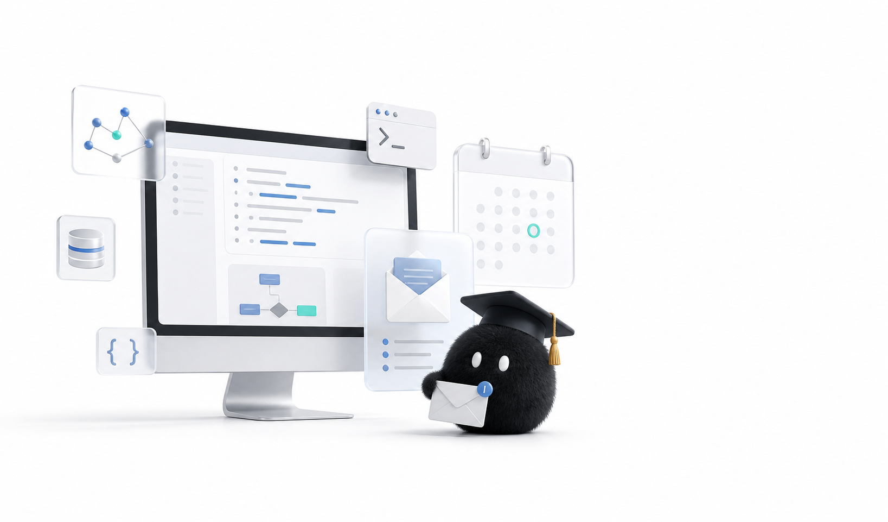

# 保研夏令营邮件订阅系统



一个部署在 Cloudflare Workers 上的轻量邮件订阅系统。用户提交邮箱并确认订阅后，系统每天定时拉取
`CS-BAOYAN-DDL` 的 `schools.json`，检测新增或重要字段变更，并通过阿里云邮件推送发送摘要邮件。

## 功能

- 邮箱订阅、确认订阅和一键退订。
- 每日定时同步 CS-BAOYAN-DDL 数据源。
- 使用 D1 保存订阅者、数据快照和通知发送记录。
- 首次运行只初始化快照，不群发历史数据。
- 后续只在发现新增或变更时发送邮件。
- 每封邮件包含数据来源、原始通知链接和退订链接。
- 管理员可手动触发一次更新检查。

## 架构

```text
用户浏览器
  -> Cloudflare Worker 订阅页面和 API
  -> Cloudflare D1 保存订阅状态和快照
  -> Cron 每天触发更新检查
  -> 拉取 CS-BAOYAN-DDL schools.json
  -> 生成 diff 和摘要邮件
  -> 阿里云 DirectMail 发送邮件
```

数据源：

```text
https://raw.githubusercontent.com/CS-BAOYAN/CS-BAOYAN-DDL/main/src/data/schools.json
```

## 技术栈

- Cloudflare Workers
- Cloudflare D1
- Cloudflare Cron Triggers
- 阿里云邮件推送 DirectMail
- TypeScript
- Vitest

## 接口

| 方法 | 路径 | 说明 |
| --- | --- | --- |
| `GET` | `/` | 订阅页面 |
| `POST` | `/api/subscribe` | 提交邮箱并发送确认邮件 |
| `GET` | `/api/confirm?token=...` | 确认订阅 |
| `GET` | `/api/unsubscribe?token=...` | 退订 |
| `GET` | `/api/health` | 健康检查 |
| `GET` | `/api/admin/run-check` | 手动触发检查，需要管理员密钥 |

手动触发检查：

```bash
curl -H "Authorization: Bearer $ADMIN_TOKEN" \
  https://baoyan.example.com/api/admin/run-check
```

## 本地开发

安装依赖：

```bash
npm install
```

创建本地 D1 表：

```bash
npm run db:migrate:local
```

创建 `.dev.vars`，该文件只保存在本地，不要提交：

```dotenv
ALIYUN_ACCESS_KEY_ID=your-access-key-id
ALIYUN_ACCESS_KEY_SECRET=your-access-key-secret
ADMIN_TOKEN=replace-with-a-long-random-string
APP_BASE_URL=http://localhost:8787
```

启动开发服务：

```bash
npm run dev
```

访问：

```text
http://localhost:8787/
```

## 阿里云邮件推送配置

1. 开通阿里云邮件推送 DirectMail。
2. 添加并验证发信域名，例如 `example.com`。
3. 按控制台提示添加 SPF、DKIM、TXT、DMARC 等 DNS 记录。
4. 创建发信地址，例如 `notify@example.com`。
5. 创建 RAM AccessKey，并授予调用邮件推送接口所需权限。
6. 将 AccessKey 写入 Cloudflare Secrets 或本地 `.dev.vars`。

Worker 使用阿里云 RPC API 的 `SingleSendMail` 接口发信，不依赖阿里云 Node SDK。

## Cloudflare 部署

创建 D1 数据库：

```bash
npx wrangler d1 create baoyan-mail-db
```

把输出的 `database_id` 写入 `wrangler.toml`：

```toml
[[d1_databases]]
binding = "DB"
database_name = "baoyan-mail-db"
database_id = "your-d1-database-id"
```

应用远程迁移：

```bash
npm run db:migrate:remote
```

设置生产密钥：

```bash
npx wrangler secret put ALIYUN_ACCESS_KEY_ID
npx wrangler secret put ALIYUN_ACCESS_KEY_SECRET
npx wrangler secret put ADMIN_TOKEN
```

修改 `wrangler.toml` 中的非敏感变量：

```toml
APP_BASE_URL = "https://baoyan.example.com"
ALIYUN_DM_ACCOUNT_NAME = "notify@example.com"
SENDER_NAME = "保研通知"
BATCH_SIZE = "50"
ITEMS_PER_EMAIL = "30"
```

部署：

```bash
npm run deploy
```

如果使用自定义域名，需要先在 Cloudflare 中接入对应 zone，再为 Worker 配置 route 或 custom domain。

## 定时任务

`wrangler.toml` 默认配置：

```toml
[triggers]
crons = ["0 1 * * *"]
```

Cloudflare Cron 使用 UTC 时间。`0 1 * * *` 对应北京时间每天 09:00。

## 更新检测规则

- 将学校、院系、标题、截止时间、链接和标签标准化为通知记录。
- 使用稳定 key 识别同一条通知。
- 对比上一轮快照，识别新增和重要字段变化。
- 首次运行只保存快照，不发送历史通知。
- 没有更新时不发送邮件。
- 没有 active 订阅者时，通知会被标记为已处理，避免后续新订阅者收到历史积压。

## 测试

运行类型检查和单元测试：

```bash
npm run typecheck
npm test
```

本地模拟更新流程：

1. 使用真实数据源初始化本地快照。
2. 准备一份临时 JSON 数据源，在其中追加一条模拟通知。
3. 临时在 `.dev.vars` 中设置 `SOURCE_URL` 指向模拟数据源。
4. 调用 `/api/admin/run-check`。
5. 检查返回值中 `detected` 是否大于 `0`，并确认 active 订阅者收到摘要邮件。
6. 测试结束后删除 `.dev.vars` 中的 `SOURCE_URL`。

## 安全说明

- 不要提交 `.dev.vars`、Cloudflare API token、GitHub token、阿里云 AccessKey 或管理员密钥。
- 生产密钥应使用 Cloudflare Secrets 管理。
- 如果任何密钥曾经出现在聊天、日志、截图或公开仓库中，应立即轮换。
- 公开仓库中的 `APP_BASE_URL`、发信地址和 `database_id` 应使用占位值，部署时再替换为真实值。

## 许可证

本项目使用 MIT License，详见 [LICENSE](LICENSE)。
